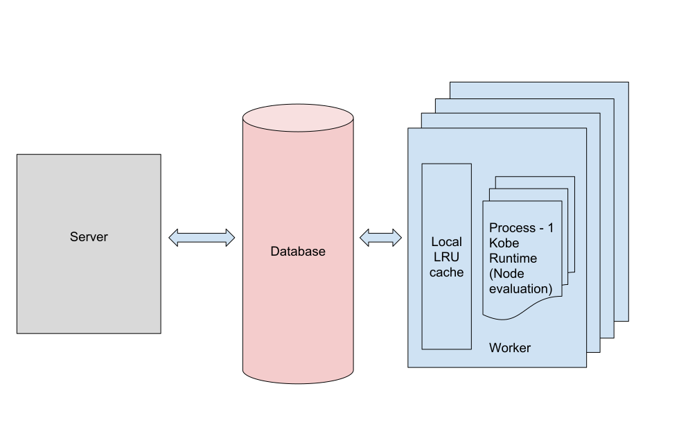

# Installation

  Please follow the steps given in the README.md file to install Kobe

# What is Kobe
  Kobe is an open source simulation tool written in Python which can model artificial spiking neural networks, along with its environment ( using OpenAI Gym ), with more focus on the computational or funcional aspect rather than the biophysical one.
    
# TL;DR 
   I shall begin this section by saying that its optional. Though you don't have to read all of this stuff to start using Kobe, it provides some background as to the problem that Kobe is trying to solve. I am assuming that you, as a reader haven't stumbled upon this page by mere accident and that you are familiar with artificial neural networks ( ANNs ). ANNs have proven their worth in a wide range of areas like image processing, natural language processing, classification, prediction etc. The problem though with ANNs of today is that they can solve only a specefic task and do not exhibit a 'General Intelligence'. There are fundamental differences between how a biological neural network works and how an artificial one works. Kobe tries to bridge this gap.  

   Most implementations of AI today employ Machine Learning algorithms to make their applications smarter. Although AI has been known to and used by researchers since many decades, it's proliferation into the consumer space occured only after the average computing power increased manifold in the last two decades. AI is actually a broader term which means a smart system designed deliberately to carry out tasks deemed as intelligent. Thus, a very complex system of hardcoded rules, interdependent on each other could make up an ostensibly good AI. But, it cannot ( as of now ) necessarily transform a machine into a sentient being. The brain (of any species) itself is a complex system of hardcoded rules, but there are subtle differences in a deep neural network (which is the latest advancement of ANNs employed in an AI system) and the biological brain. 
    Can today's AI make a machine seem as intelligent as a human? Yes. The emergent behaviour of the latest AI implementations does seem to **roughly** imitate the emergent behaviour found in humans, including speech and voice, but the rules are hardcoded nonetheless. I do not mean by this, that each response is hardcoded in the robot; that would be insane. What I mean is, there is hardcode in the mapping of outputs to ideas which that output represents. Also, the learning rules in the artificial neural network are different from those that of the biological counterpart.
    Can today's AI make a machine possible of exhibiting conscious thought? Unlikely.
   ## Difference between ANNs and biological NNs
  Perhaps the most important difference in ANNs and bioloical neural networks is that of time. ANNs pass information to each other based on the intensity of their output. On the contrary, biological neurons seem to communicate based on modulation of their firing rate. Not only timing, but also the inter-connectivity is different in biological neural networks. They are characterized by large recurrent feedback loops, and seem to be organized into distinct layers. I simply cannot mention and explain all the differences here, the list is extensive.      
   ## Is it even possible ?
   The goal of Kobe is not full brain simulation, such a thing is premature, inconceivable and might not even be possible at all. The goal is to help AI researchers, neuroscientists and enthusiasts in creating, testing and implementing novel algorithms, morphologies and methods which are closer to the biological brain while forcusing on the computational rather than the biological aspect of the simulation.  
# Other similar projects
 There are many excellent simulation tools out there like BRIAN, Neuron, Genesis etc. In this section, I have described the major ones in short.
 
 NEST is a very powerful simulator with the capability to create large scale biologically realistic networks of neurons.
 
 BRIAN is an open source Python package for simulating spiking neurons. It offers flexibility by giving users the option of writing their own model of neurons, and then converting it to a language closer to hardware for faster execution.
 
 GENESIS is a software which can simulate large scale networks, like the neocortex.
 
 NEURON is similar to GENESIS and comes with a GUI builder for creating networks easily. Also useful for modelling an individual neuron.
 
 ## Some key differences between these projects and Kobe are:
 1. The process of creating a network is made very easy in Kobe. You need to only create a single file for defining the whole network.
 2. Kobe tries to create a non-ideal model of the brain as opposed to a completely ideal biophysical model. In Kobe, we consider a node as a point neuron and modelling of intraneuronal dynamics, though possible, is discouraged. This is explained in more detail in the next section.
 3. A Network in Kobe is actually an OpenAI Gym Agent, which is present in an Environment. This way, we try to complete the circuit which is essential for any host present in a system to learn and grow. Maybe life on earth formed only because of the periodicity of the revolution of the earth around the Sun, and its revolution about itself. Circadian rythms and sleep cycles would never form if the earth were stationary about its orbit. Basically, the Environment in which an agent is present is crucial for its development. Thus we model the Environment in addition to the Agent.
 4. Although differential equations are beautiful, they are discouraged. Instead, an optimized heuristic can used for achieving the same results.
 
# Do we need to simulate everything?
 This section might be a little biased towards my own views about computation and simulation. There is a tradeoff between the level of detail to which we can simulate a particular thing, and the computing power required for doing it. More the detail we try to simulate, more is the computing power required.  
 One goal of Kobe is to find the minimum level of detail required to generate a plausible simulation. 
 
 Above is an illustration of the approximate computing power required to simulate the whole brain ( around 500 petaflops for 100 billion neurons ). It indicates that we are going to run out of computing power if we try to simulate every minute detail that there is. Instead, we can compensate some of the less important things for some important details which actually play a significant role in computation. Maybe we could let go of the position in space where the neurons are present, the location of an individual spine on the dendrite, the intraneuronal messaging system etc. Below is a table, detailing the phenomena simulated in Kobe.
  
   Morphology 
   |Name                                   | Present in Kobe  |
   |-------------------------------------- | -----------------|
   |multiple neuron types                  | Yes              |
   |layer wise seperation of neuron groups | Yes      |
   |locally connected neurons              | Yes   |
   |large number of inter-layer and intra-layer connections | Yes  |
   |columnar organization                  | Yes  |     
   |multi-compartment neurons              | No  |
   |simulation of individual synapse to micro level | No  |
   |intraneuronal communication            | No              |
 
   Evaluation
   |Name                           | Present in Kobe |
   |------------------------------ | ----------------|
   |spatio-temporal leaky integrate and fire       | Yes  |
   |homeostatic regulation   | Yes  |
   |consideration of propagation delays | Possible  |
   |multiple neurotransmitters     | Possible  |
   |stochastically firing neurons  | Possible  |
   |activation dependent on spine location on denrite | No  |
   |simulation of glial cells | No  |
  
   Plasticity
   |Name                           | Present in Kobe | 
   |------------------------------ | ---------------- |
   |spike-time dependent plasticity| Yes  |
   |reward based learning / neuromodulation | Yes  |
   |short term depression          | Yes  |
   |short term facilitation        | Yes  |
   |heterosynaptic plasticity      | Possible  |
     
   
   Pruning and generation 
   |Name                           | Present in Kobe  | 
   |------------------------------ | ----------------|
   |node pruning                   | Yes  |
   |connection pruning             | Yes  |
   |formation of new connections ( opposite of pruning )  | Possible  |
  
  A simulation in Kobe is based primarily on a computational or functional aspect, rather than the biophysical aspect. Meaning, Kobe does not try to model an ideal neuron and an ideal biophysically plausible network of neurons. Infact, doing do may be counterproductive, inefficient and a waste of computing power. This is a very dangerous assumption that the whole idea of Kobe rests on; if at any point in time, it is proved that an ideal simulation is necessary for generating a complete simulation of emergent behaviour, Kobe would be obsolete. Proving one would require disproving the other, another purpose for Kobe to exist.
        

# Software Architecture
  
  Kobe has the following top-level structural components:
  ## 1. Database
   Kobe uses a caching database ( Redis ) internally to store each node of the entire graph as a json string. This makes the whole graph accessible from any device on the local area network. Thus Kobe is scalable horizontally with the number of cpu cores. Everything is stored on the database.
  ## 2. Worker
   Each device has a separate worker running on it, which subscribes to a global queue. The main server issues jobs ( a job in Kobe is information for a worker containing the Node IDs to be processed ) and the workers pick these jobs at random, process them, and put the status in a result queue.
   
  ## 3. Server
   This is the main server which handles every operation, like issuing jobs, loading the network graph from the database into memory, visualization, logging the output to disk and so on. This is the place where the OpenAI Gym Environment is simulated. 
  
  Kobe has mainly three funtional components:
  ## 1. Node
   A Node is nothing but the smallest unit which can be 'processed' by a worker. Basicaly it is the counterpart of a neuron. Only neurons can be nodes, unlike in some other projects where a probing device (which lets you measure the activity of a neuron) can also be a Node. A larger unit processed by a worker is a Job.
  ## 2. Ensemble
   An ensemble is a large group of nodes which can be processed atomically. By definition, an 'ensemble' is an aggregation or a group of many things. Here, it is equivalent to 'a collection of multiple cliques of neurons'. Multiple workers process an Ensemble. In the default example, the V1 cortex, Thalamus, Retinal layer etc. are all modelled as Ensembles.
  ## 3. Network
   It can be defined as the computation graph, the order to follow while evaluating the Ensembles. Kobe first converts any given directed graph into a Directed Acyclic Graph; it removes any cycles if present. Then, it evaluates each Ensemble according to the graph. 
    
  The workers in Kobe are general purpose. They do not hold an awful lot of neurons in memory at any given time. Instead, they **load** the whole neuron, process it, and update its parameters if it fires. The operations in Kobe are atomic and computation progresses layer-by-layer. In effect, all the workers can work on only one layer at any point in time. In case of feedback loops, there is a delay of one whole iteration for simulating the recurrent state. 
    
  Each device can run only one worker. The worker spawns multiple processes which process the Nodes. The child processes of the worker talk only to the main process, the main process has an LRU ( least recently used ) cache which syncs with the global database ( Redis ) every time a node is processed. The LRU cache can hold only a handful of neurons at a time.  

# The Kobe Runtime
  The Kobe runtime is the code which gets executed on the remote devices i.e. the workers. The evaluation of Node state and online training happens here. This is the place where the algorithm for the smallest time step of the simulation is defined.

# Atomic operations
  While computing a recurrent graph or a network, the hurdle is in determining the order in which each vertex in the graph or each node in the network are evaluated. As the ouput of the nodes is dependent on other nodes, changing the order changes the output. In Kobe, the Nodes are evaluated layer-by-layer. But within a single layer, what decides the order in which the Nodes are evaluated? There are two ways in which this can be done:
  1. Asynchronously - Maintain a predetermined order ( could be based on propagation delays, such that the one with the least delay is evaluated first ) or evaluate all nodes at random.
  2. Synchronously - Hold all the outputs of the nodes in that layer, and update them only when the whole layer is processed.
  
Approach #1 seems plausible and is in the roadmap of development. Approach #2 seems difficult to implement. Currently, neither is implemented in Kobe in its entirety.
 
 ## Current implementation in Kobe
  In Kobe, a small group of Nodes are processed in batches. These batches are put on the global queue sequentially, but they are picked up by the workers randomly. Thus, it can very well be considered as random.
 
# Model of the brain
In the following sub-sections, we shall dive into the structural and functional aspects of the brain 

## Morphology
 A huge difference between an ANN and a biological one is morphological. The neocortex is cytoarchitectonically composed of multiple layers stacked on top of each other. The ANNs are based on our understanding of how the brain might arrange representations into a hierarchy. But what we observe in a real brain is a combination of sideways hierarchy as well as a vertical hierarchy. Every primary sensory area in the neocortex is connected to a higher functional area which is adjoining the primary area (sideways hierarchy) and every area itself has numerous inter-layer feedforward and feedback connections (vertical hierarchy). Although a lot of research is now being conducted in this direction, inter-areal cortico-cortical connectivity is still kind of a gray area in neuroscience (pun intended).
 
### Canonical microcircuit of the neocortex
   The neocortex is roughly a 2-4 mm thick region made up mostly of neuronal cell bodies. It was discovered in the mid 20th Century that the neocortex is organized into distinct layers. Each layer of the neocortex is stacked on top of the other, forming a column of sorts. This columnar organization is repeated throughout the cortex, with some differences in the connectivity between different areas. Eg : Layer 4 of the cortex is thick in areas where it receives inputs from subcortical regions i.e. the thalamus. In other regions, Layer 4 receives cortico-cortical feedforward connections and is thinner. Though this is an area of ongoing research, enough information is now available than ever was, which should be taken advantage of. 
    
### Modelling other parts
   The other significant parts in the mammalian brain are thalamus, TRN (thalamic reticular nucleus), basal ganglia, substantia nigra etc. These parts work in conjuncion with one another to produce the conscious experience. It is a well known fact that there is a humongous number of feedback connections from the cortex to the thalamus. Some theories suggest that these connections along with the TRN (which is inhibitory) act as a filter for the information passed on to the cortex. The substantia nigra is responsible for regulating the dopamine levels in the cortex.
   
## Evaluation
 First, lets define some terminology used here:
  macro-scale effects : phenomena spanning multiple neurons, hundreds to thousands to millions, maybe even a whole cortical area 
  
  micro-scale effects : phenomena spanning one or two neurons
  
### Activation function
   There exist numerous models of a neuron in literature, which define its behaviour. Out of these, the one which is modelled in Kobe by default is integrate and fire with exponential decay. This is simple to implement, and also computationally efficient. **While there is no restriction on writing differential equations and executing them in the Kobe runtime, it is discouraged.** It is better to first convert any differential equations into an equivalent heuristic, this is what is done in the default example.

## Plasticity 
   This is the most elusive part of the whole story and at the end of this section you are going to think that it is impossible to ever simulate the brain. There are **contradictory** findings on how plasticity works. Plasticity is thought to be dependent on the balance which is reached by the push and pull effects of various phenomena at play in vivo. There is competition in the brain at every level, micro (spanning few neurons) and macro (spanning multiple neurons, or even a whole cortical area). Also, the rules of plasticity seem to be different between different regions (cortex vs. hippocampus). Plasticity can be synaptic as well as non-synaptic, homo- as well as hetero- synaptic. Hetero-synaptic plasticity and neuromodulation are both macro level effects which can be modelled in Kobe. Infact, it is unclear what is the distinction between them.  
  
### Spike-time dependent plasticity
   Donald Hebb in 1949 formulated what is known today as Hebbian rule of learning. This rule is famously known by the phrase "Neurons that fire together, wire together". Later experiments revealed that a temporal component is a necessary factor which determines whether the neurons' association with other neurons increases or decreases. If a neuron fires before another one fires, then actually their association decreases i.e. the weight between them decreases This can be modelled as the stdp rule or a window rule (which is computationally more efficient)
  
### Reward & Novelty based learning
   This is in part similar to heteroplasticity.  When a reward in the form of neurotransmitter is released, it affects a large area in the brain. In Kobe, this is modelled by a macro-scale "variable" which is **accessible** to all the nodes in a particular Ensemble. This variable could then be used to scale the intensity of activation of all the nodes in that Ensemble.
  
### Multiple neurotransmitters
   A biological neuron has receptors which respond to multiple neurotransmitter, rather than just one. This is what makes things even more complicated. There are hundreds of neurotransmitters in the brain, but a handful of them are active. Even then, it complicates things. That's because every neurotransmitter released by the pre-synaptic neuron affects the postsynaptic neuron differently, and the effects may be combined or seperate. Thus, say a neuron responds to different neurotransmitters and say it has 5,000 pre-synaptic connections, we are talking about maintaining 15,000 connections, for each of the 3 types of neurotransmitters. 

## Pruning 
   As infants, we start off with a whole lot more neurons than we have as adults. Babies have all the neurons they will ever have. Thus we constantly lose neurons throughout our life. Maybe the brain compromises the quantity of neurons for quality (representation of complex ideas). Also, the weights in the network change over time. These are simulated in Kobe in the following ways: 
   
### Node pruning
   The neurons which are least active, are pruned off. This operation is done offline (outside Kobe Runtime) after a predefined number of iterations.
   
### Connection pruning (and generation)
   This is a form of plasticity, whereby the connections made by the neurons change over time. Weak connections are pruned, and it is possible to generate new connections (maybe towards the nodes which are most active). This operation is done online as it is more efficient.
   
## Propagation delays
  Every biological neuron has finite axonal and dendritic lengths having an intrinsic propagation delay which are thought to contribute towards the overall delay of the network.
  
## Recurrent loops
  A biological brain has recurrent loops everywhere; be it to and from the same neuron, from one neuron to other neurons, or from multiple neurons to multiple other neurons (cortico-thalamic pathways). Here, the destinations of feedback loops are evaluated in the next iteration (forward pass). Meaning, there is a delay of whole one iteration before the Node or Nodes which are fed back are evaluated again. In any given iteration, the outputs from previous iteration are already available along with the inputs from the current iteration.

# Sensors and Actuators
  This is perhaps the most challenging part to implement. A Sensor in Kobe is the equivalent of a temporary scratchpad on which the Environment writes the inputs to the Agent. The Agent picks them up from there, processes them, and writes the outputs to the Actuator. Sensor and Actuator are callable Python objects which are flexible enough to allow calling of custom or built-in methods for mapping of the observation (input to Agent) to the input layer in the Network ( Agent ). But how would a blob of neurons (a 3D shape) map to a 2D or a 1D shape of neurons designated as output nodes ?  It is still at a very primitive stage in Kobe. 
  
# What is OpenAI Gym
  OpenAI Gym is a toolkit for developing and comparing reinforcement learning algorithms.  A Kobe Network is an Agent in OpenAI Gym. Gym has two components, the Agent and the Environment. The Environment is what the name suggests, it is a virtual environment, inside which an Agent is simulated. Basically it provides constraints or boundaries to the Agent. The Agent can be any AI program. Think of the environment like a closed cage, and the Agent as a test subject placed in the cage, assigned to do a particular task. The Environment here provides the input to the Agent and takes its output, and reacts to it, as programmed. The Agent in turn learns to react to the Environment.

# Why is Gym needed ?
  The feedback loop between a host and the environment is very important for the host to learn about the environment. By simulating the Agent inside the Gym Environment, we are completing this loop.

# Teacher 
  The teacher is someone who checks whether an output is correct and gives a reward in return. It is essentially an ANN trained for the specific task of checking whether the simulated output is as expected. This is done just for the automation of the manual task of checking the output of the Network.

# The Agent, Environment and the Teacher
  The Gym Environment, the Agent (Kobe Network) and the Teacher together complete the loop which is essential for training the Agent.

# Issues
  There are some known issues in Kobe which affect the effeciency. Following is the whole list
   1. Redis operations are not threaded. Need to either use threadis, or some other alternative, where reads are parallel, but writes are sequential.
   2. Prevent immediate and individiual writes to database, make them buffered.
   3. The worker program is in Python, need to export it to C++.

<!-- [Page 2 : Example code walkthrough](code_walkthrough.md) -->

# References

